# 📊 LangChain Custom Chatbot with Memory - Complete Flowchart

This document provides a comprehensive flowchart showing how the LangChain Custom Chatbot with Memory project is executed, including all components, interactions, and data flow.

## 🏗️ System Architecture Flow

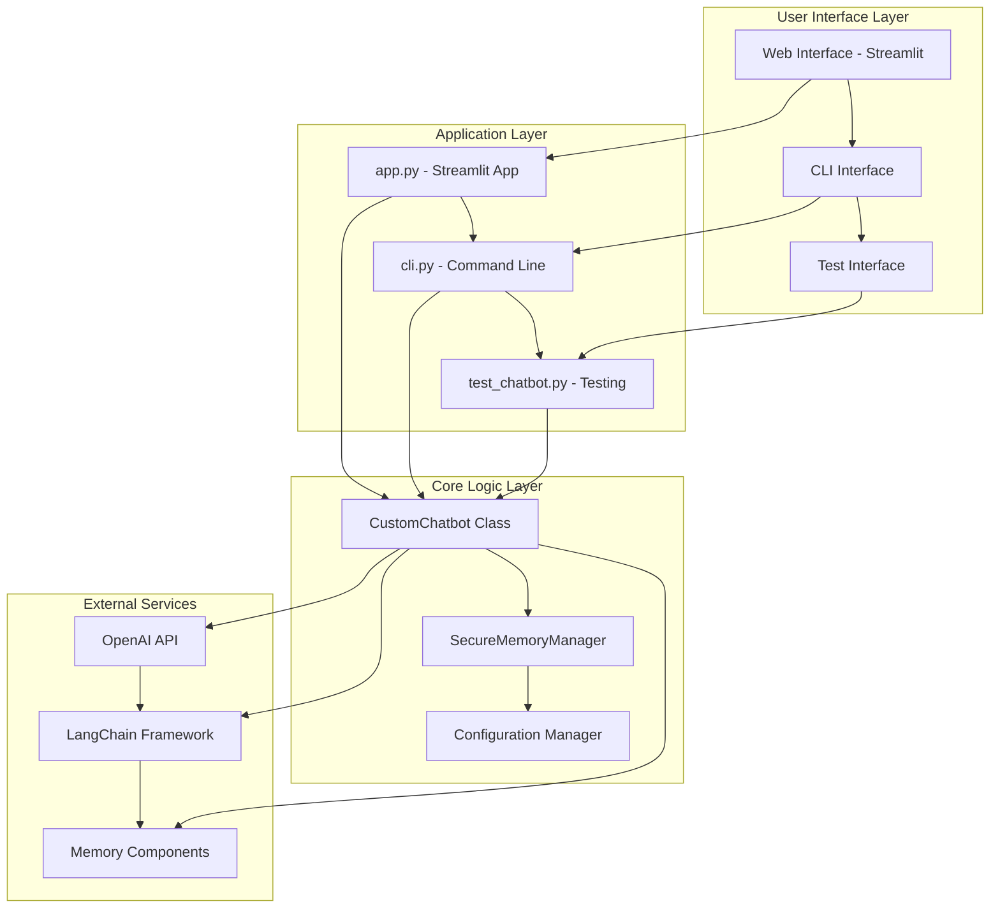

## 🔄 Main Execution Flow

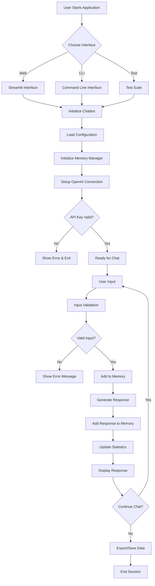

## 🧠 Memory Management Flow

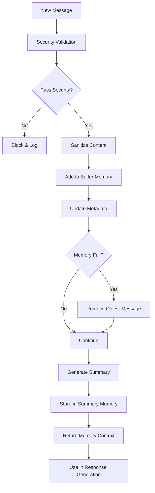

## 🔒 Security Validation Flow

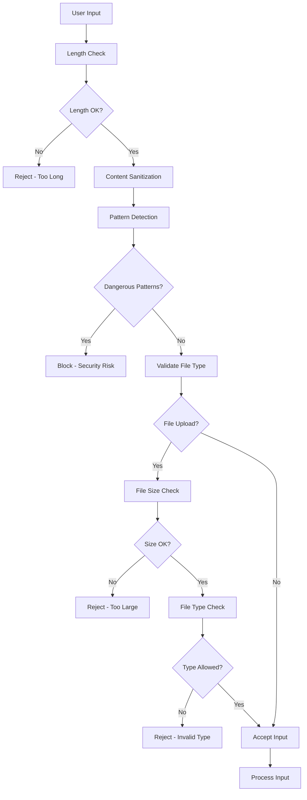

## 📊 Data Flow Architecture

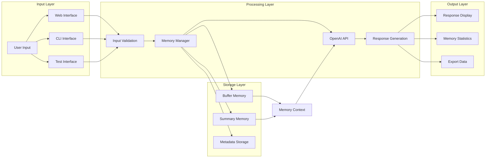

## 🧪 Testing Flow

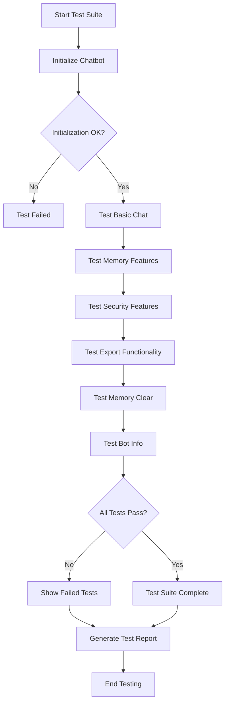

## 🔄 Conversation Flow

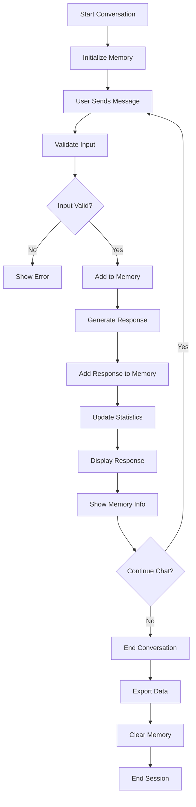

## 📁 File Structure Flow

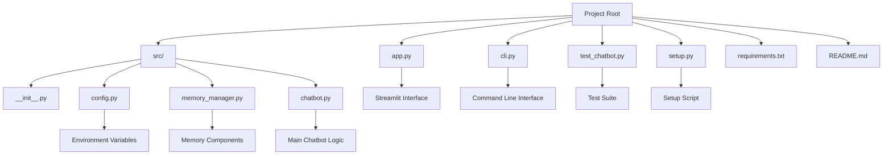

## 🔧 Configuration Flow

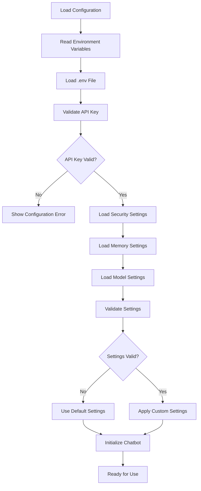

## 🚀 Deployment Flow

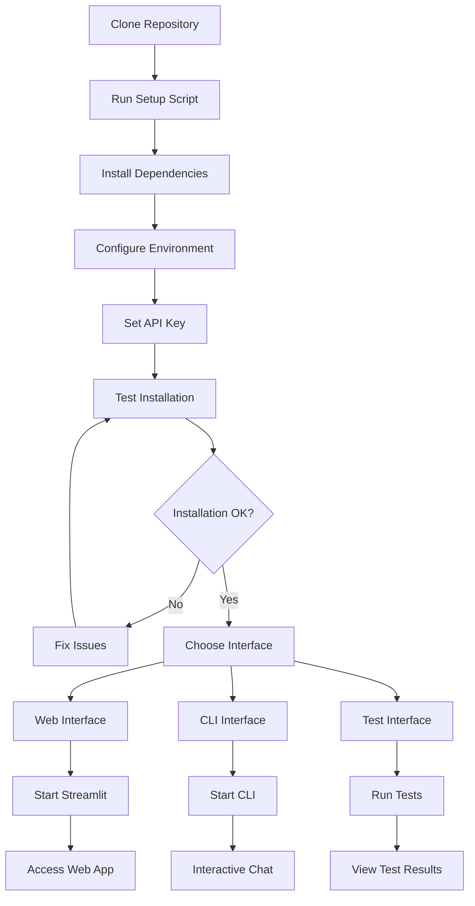

## 📈 Performance Monitoring Flow

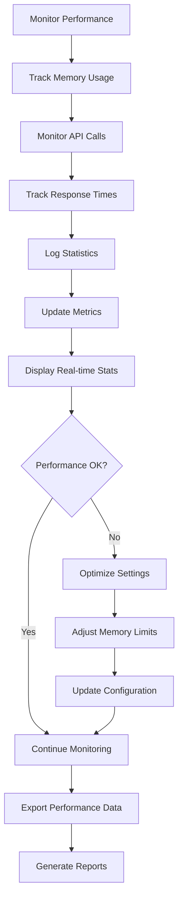

## 🔄 Error Handling Flow

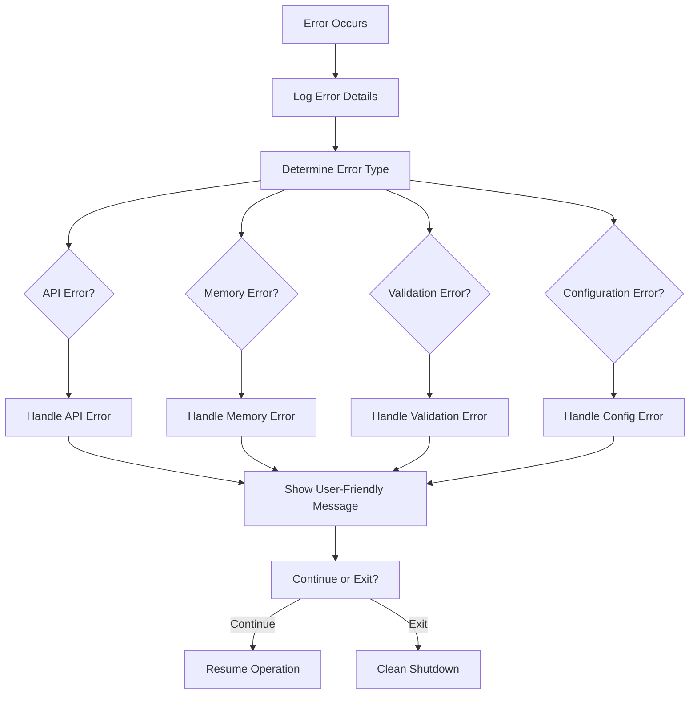

This comprehensive flowchart shows the complete execution flow of the LangChain Custom Chatbot with Memory project, including all major components, interactions, and decision points. The system is designed to be modular, secure, and user-friendly with multiple interface options and robust error handling. 