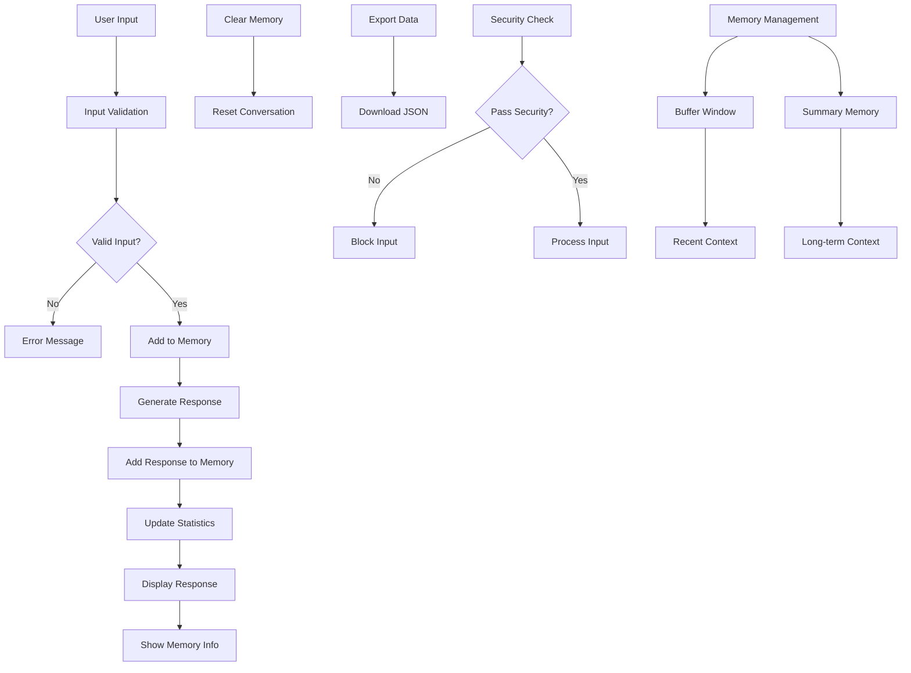

# 🤖 LangChain Custom Chatbot with Memory

A sophisticated chatbot built with LangChain that features advanced memory capabilities, security features, and a modern web interface.

## 📋 Table of Contents

- [Features](#-features)
- [Architecture](#-architecture)
- [Installation](#-installation)
- [Configuration](#-configuration)
- [Usage](#-usage)
- [Security Features](#-security-features)
- [API Reference](#-api-reference)
- [Testing](#-testing)
- [Flowchart](#-flowchart)

## ✨ Features

### 🧠 Memory Capabilities
- **Conversation Memory**: Remembers context from previous interactions
- **Buffer Window Memory**: Configurable window size for recent conversations
- **Summary Memory**: Automatic conversation summarization for long-term context
- **Memory Statistics**: Real-time tracking of conversation metrics

### 🔒 Security Features
- **Input Validation**: Length and content validation
- **Content Sanitization**: Removes potentially dangerous patterns
- **Memory Size Limits**: Prevents memory overflow attacks
- **Pattern Detection**: Blocks malicious input patterns

### 🎨 User Interface
- **Modern Web Interface**: Built with Streamlit
- **Real-time Chat**: Interactive chat experience
- **Memory Visualization**: Live memory statistics and summaries
- **Export Functionality**: Download conversation data as JSON

### 🏗️ Architecture
- **Modular Design**: Clean, maintainable code structure
- **Configuration Management**: Environment-based settings
- **Error Handling**: Comprehensive error handling and logging
- **Testing Suite**: Complete test coverage

## 🏛️ Architecture

```
LANGCHAIN_CUSTOM_CHATBOT/
├── src/
│   ├── __init__.py          # Package initialization
│   ├── config.py            # Configuration management
│   ├── memory_manager.py    # Memory handling
│   └── chatbot.py           # Main chatbot class
├── app.py                   # Streamlit web application
├── test_chatbot.py          # Test suite
├── requirements.txt          # Dependencies
├── env_example.txt          # Environment variables template
└── README.md               # This file
```

## 🚀 Installation

### Prerequisites
- Python 3.8 or higher
- OpenAI API key

### Setup Instructions

1. **Clone the repository**
   ```bash
   git clone <repository-url>
   cd LANGCHAIN_CUSTOM_CHATBOT
   ```

2. **Install dependencies**
   ```bash
   pip install -r requirements.txt
   ```

3. **Configure environment variables**
   ```bash
   cp env_example.txt .env
   # Edit .env file with your OpenAI API key
   ```

4. **Set your OpenAI API key**
   ```bash
   export OPENAI_API_KEY="your_api_key_here"
   ```

## ⚙️ Configuration

### Environment Variables

Create a `.env` file with the following variables:

```env
# OpenAI API Configuration
OPENAI_API_KEY=your_openai_api_key_here

# Chatbot Configuration
CHATBOT_NAME=MemoryBot
CHATBOT_PERSONALITY=You are a helpful AI assistant with memory capabilities.

# Memory Configuration
MEMORY_MAX_TOKENS=2000
MEMORY_RETURN_MESSAGES=True

# Security Configuration
MAX_INPUT_LENGTH=1000
ALLOWED_FILE_TYPES=txt,pdf,doc,docx
MAX_FILE_SIZE_MB=10
```

### Configuration Options

| Variable | Default | Description |
|----------|---------|-------------|
| `OPENAI_API_KEY` | Required | Your OpenAI API key |
| `CHATBOT_NAME` | MemoryBot | Name of the chatbot |
| `MEMORY_MAX_TOKENS` | 2000 | Maximum tokens for memory |
| `MAX_INPUT_LENGTH` | 1000 | Maximum input length |
| `model_name` | gpt-3.5-turbo | OpenAI model to use |
| `temperature` | 0.7 | Response creativity (0-1) |

## 💻 Usage

### Web Interface

1. **Start the Streamlit app**
   ```bash
   streamlit run app.py
   ```

2. **Open your browser**
   Navigate to `http://localhost:8501`

3. **Start chatting!**
   - Type messages in the chat input
   - View memory statistics in the sidebar
   - Export conversations as JSON
   - Clear conversation memory

### Command Line Testing

1. **Run comprehensive tests**
   ```bash
   python test_chatbot.py
   ```

2. **Interactive demo mode**
   ```bash
   python test_chatbot.py demo
   ```

### Programmatic Usage

```python
from src.chatbot import CustomChatbot

# Initialize chatbot
chatbot = CustomChatbot()

# Send a message
response = chatbot.chat("Hello, how are you?")
print(response['response'])

# Get memory information
memory_info = chatbot.get_memory_info()
print(memory_info)

# Clear conversation
chatbot.clear_conversation()
```

## 🔒 Security Features

### Input Validation
- **Length Limits**: Maximum 1000 characters per message
- **Content Sanitization**: Removes dangerous patterns
- **Pattern Detection**: Blocks script injection attempts

### Memory Protection
- **Size Limits**: Prevents memory overflow
- **Token Limits**: Configurable token limits for summaries
- **Window Size**: Limited conversation history window

### Security Patterns Detected
- `<script>` tags
- `javascript:` protocols
- `data:` protocols
- `vbscript:` protocols
- `onload=` and `onerror=` attributes

## 📚 API Reference

### CustomChatbot Class

#### Methods

- `chat(user_input: str) -> Dict[str, Any]`
  - Process user input and generate response
  - Returns response with metadata

- `get_conversation_history() -> List[Dict[str, str]]`
  - Get current conversation history
  - Returns list of human-AI exchanges

- `clear_conversation() -> bool`
  - Clear all conversation memory
  - Returns success status

- `get_memory_info() -> Dict[str, Any]`
  - Get detailed memory information
  - Returns memory statistics and summary

- `export_conversation() -> Dict[str, Any]`
  - Export conversation data
  - Returns JSON-serializable data

### SecureMemoryManager Class

#### Methods

- `add_message(message: str, is_human: bool) -> bool`
  - Add message to memory with validation
  - Returns success status

- `get_memory_variables() -> Dict[str, Any]`
  - Get memory variables for chain
  - Returns memory context

- `get_conversation_summary() -> str`
  - Generate conversation summary
  - Returns summary text

## 🧪 Testing

### Running Tests

```bash
# Run comprehensive test suite
python test_chatbot.py

# Run interactive demo
python test_chatbot.py demo
```

### Test Coverage

- ✅ Chatbot initialization
- ✅ Basic chat functionality
- ✅ Memory features
- ✅ Security features
- ✅ Export functionality
- ✅ Memory clearing
- ✅ Bot information retrieval

## 📊 Flowchart



## 🤝 Contributing

1. Fork the repository
2. Create a feature branch
3. Make your changes
4. Add tests for new features
5. Submit a pull request

## 📄 License

This project is licensed under the MIT License - see the LICENSE file for details.

## 🙏 Acknowledgments

- Built with [LangChain](https://langchain.com/)
- Powered by [OpenAI](https://openai.com/)
- UI built with [Streamlit](https://streamlit.io/)

---

**Note**: Make sure to set your OpenAI API key before running the application. The chatbot requires an active internet connection to function properly.
